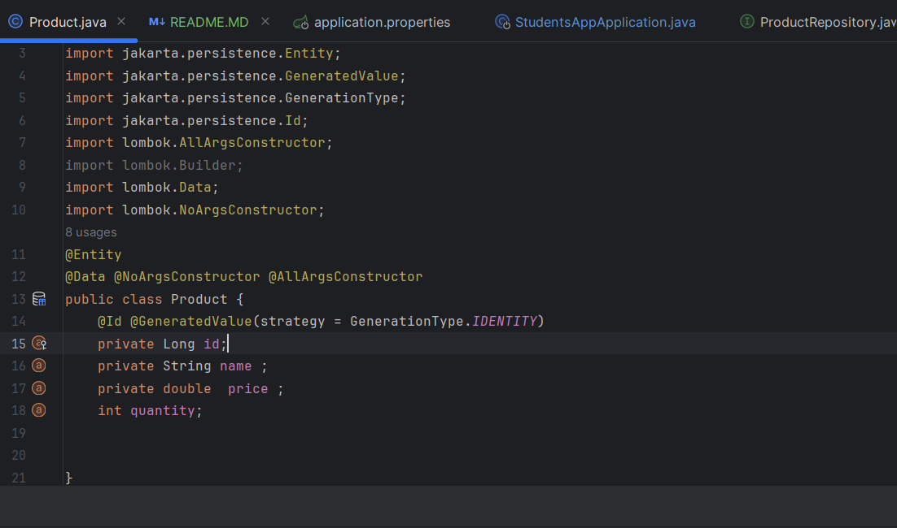
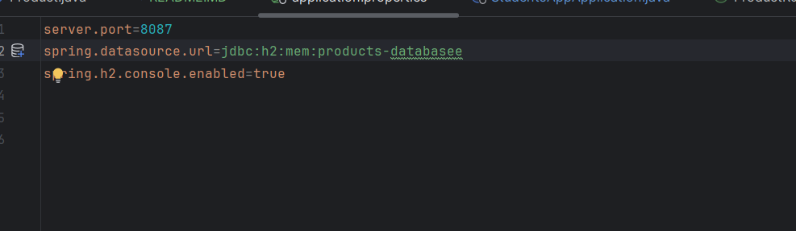
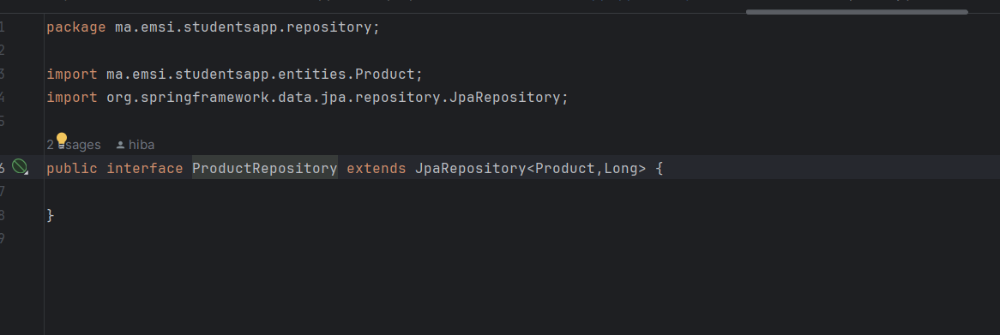
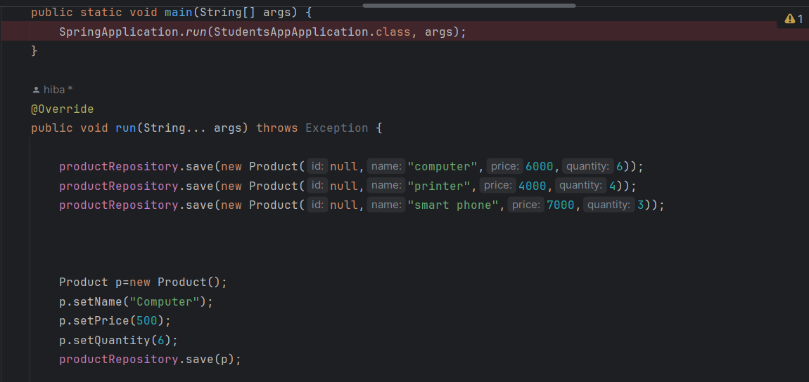
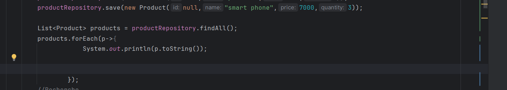
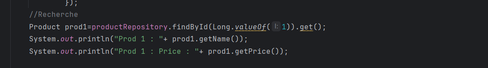
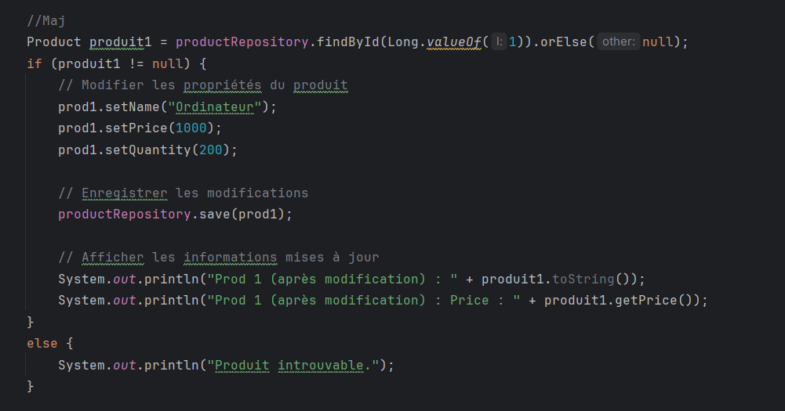
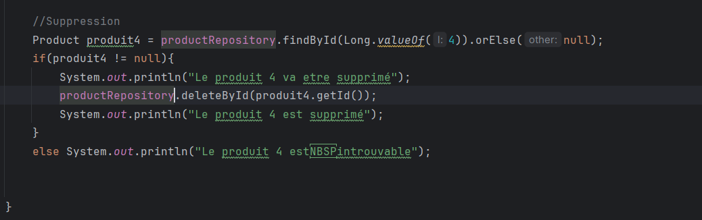

<h1>Compte rendu TP 2</h1>
<h3>Partie 1</h3>

<h5>Question 1 </h5>

<h5>Question 2 </h5>

<h5>Question 3 </h5>

<h5>Question 4 </h5> 
<h5> -l'ajout des produits</h5>

<h5> -Consulter un produit</h5>

<h5> -Chercher des produits</h5>

<h5> -Mettre à jour un produit </h5>

<h5> -supprimer un produit </h5>

<h3>Partie 2</h3>