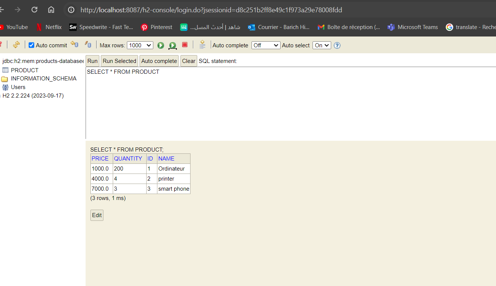

<h1>Compte rendu TP 2</h1>
<h3>Partie 1</h3>

<h5>Question 1 </h5>

<h5>Question 2 </h5>

<h5>Question 3 </h5>

<h5>Question 4 </h5> 
<h5> -l'ajout des produits</h5>

<h5> -Consulter un produit</h5>

<h5> -Chercher des produits</h5>

<h5> -Mettre à jour un produit </h5>

<h5> -supprimer un produit </h5>
6
<h5> -H2 CONSOLE</h5>

<h5>Partie 2 :</h5>
<h5> -H2 CONSOLE</h5>
< img src="Captures/cap10.png">

<h5> -Les entités</h5>

< img src="Captures/cap11.png">
< img src="Captures/cap12.png">
< img src="Captures/cap13.png">
< img src="Captures/cap14.png">
< img src="Captures/cap15.png">

<h5> -Les repositories</h5>
< img src="Captures/cap16.png">
< img src="Captures/cap17.png">
< img src="Captures/cap18.png">
< img src="Captures/cap19.png">
<h5> -Services</h5>
< img src="Captures/cap20.png">
< img src="Captures/cap21.png">
< img src="Captures/cap22.png">
<h5> -controleur</h5>

< img src="Captures/cap23.png">
<h5> -opérations de gestion d'hopital</h5>

< img src="Captures/cap24.png">
< img src="Captures/cap25.png">
< img src="Captures/cap26.png">

